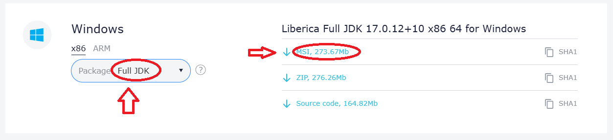
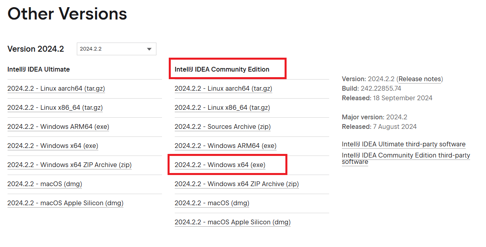
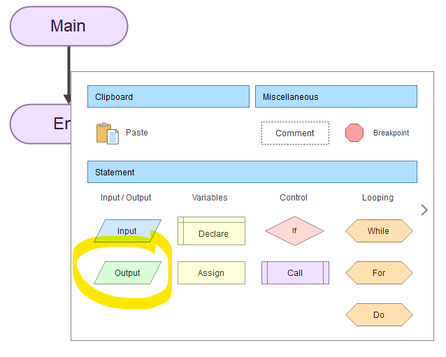
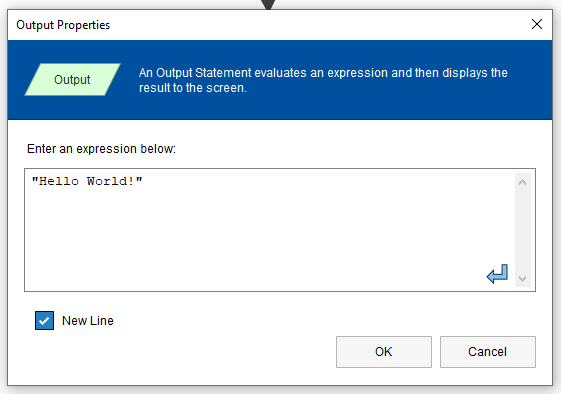

# Lab 0 - Tutorial de Instalação e Primeiros Passos com Java

Os computadores de laboratório já deverão ter o software corretamente instalado (nestes, não tem permissão para instalação), excepto o _Flowgorithm_.  

Pode, e deve, aproveitar os passos seguintes para instalar no seu computador. 

De qualquer uma das formas, teste a utilização do _jshell_ e de criação de um programa Java no IntelliJ IDEA e de um algoritmo em Flowgorithm.

## Conteúdo :pushpin:

1. Instalação do Java Development Kit (JDK) 17 LTS;
2. Instalação do IDE JetBrains IntelliJ Community Edition;
3. Utilização do JShell para imprimir "Hello World!";
4. Criação de um Simples Programa Hello World em Java;
5. Exemplo de submissão de trabalho no Moodle.
6. Instalação/uso da aplicação Flowgorithm

> :bulb: Os passos são fornecidos para o sistema operativo Windows. Contudo, o JDK e IDE  podem ser obtidos de forma semelhante em MacOS e Linux, de acordo com as formas próprias de instalação.

### 1. Instalação do JDK 17 (Liberica Full)

1. Aceda ao site oficial da _Bellsoft_: [https://bell-sw.com/pages/downloads/#jdk-17-lts](https://bell-sw.com/pages/downloads/#jdk-17-lts)
2. Selecione a versão **Windows Full JDK** (MSI installer).

    

3. Descarregue e execute o instalador.
4. Siga as instruções no ecrã para completar a instalação.
5. Para verificar se a instalação foi bem-sucedida, abra a _Prompt de Comando_ e digite:
   ```bash
   java -version
   ```
   Deve ver a versão do Java instalada (JDK 17).

> :bulb: A "Prompt de Comando" é uma linha de comandos, e.g., `Cmd` ou `Powershell`. Pode aceder a elas a partir do menu _Start_.

---

### 2. Instalação do IDE JetBrains IntelliJ Community Edition

> **IDE** significa _Integrated Development Environment_.

1. Aceda ao site oficial do IntelliJ IDEA Community Edition: [https://www.jetbrains.com/idea/download/other.html](https://www.jetbrains.com/idea/download/other.html)

2. Descarregue a versão para o seu sistema operativo, exemplo:

    

3. Execute o instalador e siga as instruções.

4. Após a instalação, abra o IntelliJ IDEA. 

   No primeiro uso:
   - Escolha a JDK que instalou anteriormente (JDK 17) nas configurações de ambiente.
   
---

### 3. Utilização do JShell para imprimir "Hello World!"

O JShell é um REPL (_Read-Eval-Print-Loop_) do Java, que permite executar comandos e scripts Java em tempo real.

> :bulb: É um *interpretador* de código-fonte.

1. Após a instalação do JDK 17, abra um terminal ou prompt de comando.
2. Digite `jshell` para iniciar o REPL:
   ```bash
   jshell
   ```
3. Para imprimir "Hello World!" no JShell, digite:
   ```java
   System.out.println("Hello World!");
   ```
4. Pressione **Enter** e o JShell exibirá a saída:
   ```plaintext
   Hello World!
   ```

5. Para sair do JShell, digite:
   ```bash
   /exit
   ```

---

### 4. Criação de um Simples Programa Hello World em Java

Agora vamos testar o IntelliJ IDEA com um programa básico em Java.

#### Passos:

1. Abra o IntelliJ IDEA.
2. Clique em **File > New > Project...**.
3. No wizard que surge, garanta que:
    - _Language_ está selecionada como "Java";
    - _Build system_ está selecionado como "Maven", e;
    - O _JDK 17_ está selecionado.
4. Dê um nome ao projeto (por exemplo, `HelloWorldProject`). Pode também alterar a localização em disco onde o projeto será criado.
5. Clique em **Create** para criar o projeto.
6. Dentro do projeto, clique com o botão direito na pasta `src/main/java` e selecione **New > Java Class**.
7. Dê o nome `HelloWorld` à nova classe e prima ENTER.
8. No editor, digite o seguinte código:

   ```java
   public class HelloWorld {
       public static void main(String[] args) {
           System.out.println("Hello World!");
       }
   }
   ```

9. Para executar o programa, clique com o botão direito no arquivo `HelloWorld.java` e selecione **Run 'HelloWorld.main()'**.

   O terminal embutido do IntelliJ exibirá o seguinte _output_:
   ```plaintext
   Hello World!
   ```

> :smile: Agora instalou o JDK 17, IntelliJ IDEA, testou o JShell e criou seu primeiro programa Java com sucesso!

---

### 5. Exemplo de submissão de trabalho no Moodle

1. Navegue no explorador de ficheiros até à pasta que contém o projeto `HelloWorldProject` (o projeto está contido nesta pasta).

2. Compacte essa pasta num ficheiro `zip` com o nome `<numero_aluno1>_<numero_aluno2>.zip`;

3. Entre na página do Moodle de IPOO e aceda ao link de submissão de trabalhos com o nome "Lab 0 - Submissão".

4. Faça a submissão do ficheiro _zip_ criado anteriormente. Garanta que recebe visualmente a confirmação de submissão do trabalho.

### 6. Instalação/uso da aplicação Flowgorithm

A aplicação `Flowgorithm` permite definir algoritmos com recurso a fluxogramas e executar esses mesmos algoritmos, variando a velocidade de execução; isto é útil para visualizarmos atentamente o fluxo de execução do algoritmo. Possui uma consola de interação para _input_ e _output_, assim como ferramentas adicionais para inspecionar o valor de variáveis.

A aplicação pode ser obtida a partir de <http://www.flowgorithm.org/download/index.html>.

#### Instalação/Execução

Existem duas formas de instalar e/ou executar a aplicação:

- Instalar o programa de forma normal, utilizando o `Windows 64-bit installer`, ou;
    - :bulb: Pode utilizar esta alternativa num computador próprio. A aplicação instala-se como outra qualquer; no final executa a aplicação através do menu `Start`.
- Descarregar apenas o executável, utilizando o `Windows 64-bit. Executable Only`.
    - :warning: Esta é a única alternativa para os computadores do laboratório e a que será descrita em seguida.

Deverá seguir os seguintes passos num computador da escola:

1. Descarregue o ficheiro _zip_ do link `Windows 64-bit. Executable Only`.
2. Dscompacte o arquivo para a sua pasta `Documents` (os seus ficheiros/pastas pessoais irão aparecer em qualquer computador em que inicie sessão).
3. Execute o programa `Flowgorithm.exe`.

> :warning:  
> Infelizmente, é uma aplicação exclusiva para Windows.
>
> Pode existir sucesso em utilizar esta aplicação noutros sistemas operativos, através de _emulação_:  
> - **MacOS** [Não testada :-1:]: <https://github.com/jostasik/Flowgorithm-macOS>  
> - **Linux** [Testada :+1:]: Instale o `Bottles`, crie uma nova _bottle_ do tipo `Application` e dentro desta execute o instalador anterior. 

#### Hello World em fluxograma

Quando abrir a aplicação, irá aparecer o algoritmo `Main` inicial.

1. Clique na seta entre `Main` e `End` e na caixa escolha o bloco `Output`:

    

    Irá aparecer um novo bloco `Output` a cinzento. Isto significa que está vazio.

2. Faça duplo clique sobre o bloco para determinar o que será escrito na consola:

    

    Introduza o texto `"Hello World!" ` e clique em OK.

3. Execute o algoritmo através do botão ▶️ ou do atalho `F5`. Veja que a mensagem aparece na consola interna.

---

bruno.silva@estsetubal.ips.pt